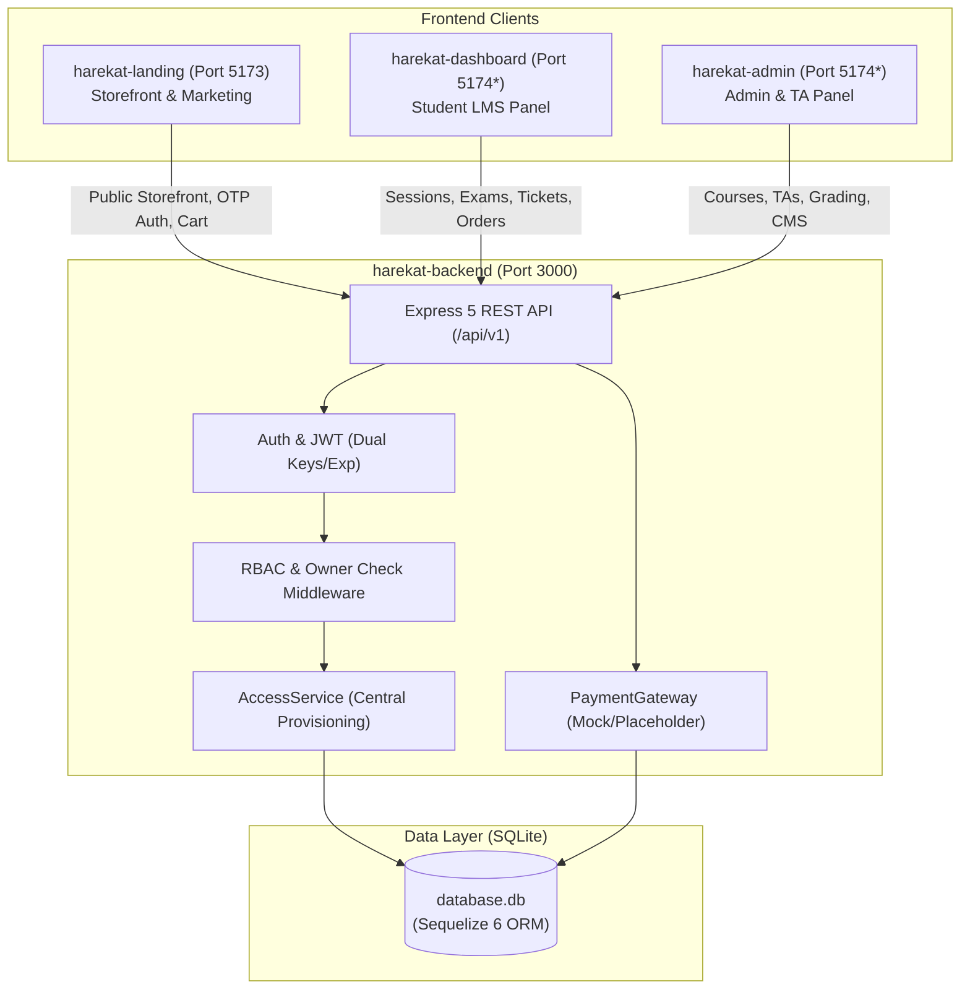
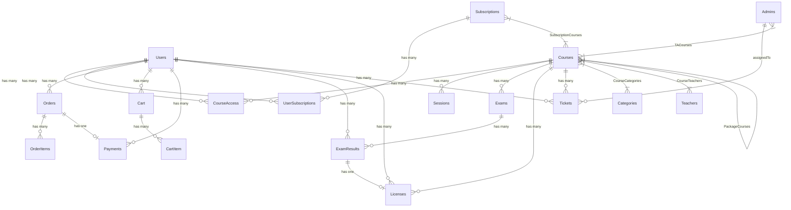
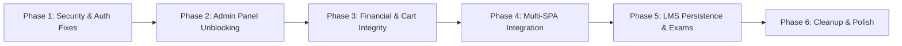

# Full System Audit

## 1. Executive Summary

This audit is an exhaustive, code-level inspection of the Harekat platform codebase across its four primary subsystems:
1. **Admin Panel** (`harekat-admin`) — React 19 / MUI / Vite admin dashboard for platform managers and teaching assistants (TAs).
2. **User Dashboard / LMS** (`harekat-dashboard`) — React 19 / MUI / Vite learning management portal for enrolled students.
3. **Landing Page** (`harekat-landing`) — React 19 / Tailwind CSS / Motion storefront for course marketing, discovery, and OTP entry.
4. **Backend / API** (`harekat-backend`) — Node.js / Express 5 / Sequelize (SQLite) REST API powering data models, business logic, access provisioning, and media uploads.

### Key Finding & System Coherence Verdict

The four sub-projects currently **do not function as a unified, production-ready system**. While several individual components are cleanly styled and certain backend subsystems (such as the multi-source access provisioning in `AccessService`) are conceptually well thought out, there are **critical architectural fractures, security holes, and cross-system disconnects** that prevent end-to-end operation:

1. **Catastrophic Admin Authorization Bug**: The `Admins` model restricts admin roles to `['superadmin', 'ta']`, but `ownerCheck.js` (`adminOnly`) requires `role === 'admin'`. As a result, superadmins are rejected with HTTP 403 on nearly half of all admin routes (Coupons, Banners, Categories, Teachers, CMS Menu, Site Content, Students, File Uploads). The admin frontend interceptor catches this 403 and immediately logs the admin out, making large sections of the Admin Panel unusable.
2. **Public Superadmin Registration**: The endpoint `POST /api/v1/admins/register` is exposed publicly without any authentication or secret key, allowing any user on the internet to create a `superadmin` account.
3. **Production Authentication Black Hole**: The backend contains no SMS provider integration. In development, an OTP bypass (`123456`) exists; in production, an OTP is generated and stored in SQLite, but is neither sent to the student nor returned in the API response. Real user login/registration is completely non-functional in production.
4. **Completely Disconnected LMS Dashboard**: The Landing Page contains its own duplicate, mock `Dashboard.jsx` page with hardcoded courses. When users authenticate on the landing page, they are navigated to this internal mock page. The actual LMS student application (`harekat-dashboard`) is never reached, and is not configured in the backend's static file server or production routing.
5. **Client-Controlled Pricing Vulnerability**: The `CartController` accepts the product `price` directly from the client request body and saves it to the database cart. The `OrdersController` computes total amounts from this untrusted cart item price. Any student can buy any course or subscription for 0 or 1 IRR.
6. **Privilege Escalation in Profile Update**: Students updating their own profile via `PUT /api/v1/users/:id` can include a `courseIds` array in the request body, which the backend sets directly on the user, granting free access to any course.
7. **Fabricated LMS Learning Progress**: The LMS progress board, completion status columns, rubies, and points are either stored in browser `localStorage`, hardcoded in JS constants, or calculated using arbitrary formulas (`45 + ((index * 23) % 50)`). There is no backend model for student lesson progress or video tracking.

---

## 2. Project Architecture

### 2.1 Repository Structure

```
/Users/mohammad/WebstormProjects/harekat/
├── harekat-admin/        # Admin Panel (React 19 + MUI v9 + Tailwind v4 + Vite 8, HashRouter)
├── harekat-dashboard/    # User Dashboard / LMS (React 19 + MUI v6 + Vite 8, BrowserRouter)
├── harekat-landing/      # Public Storefront (React 19 + Tailwind v4 + Motion + Vite 8, BrowserRouter)
└── harekat-backend/      # REST API & Static Server (Express 5, Sequelize 6, SQLite3)
```

### 2.2 System Architecture Diagram



*Note: Both `harekat-admin` and `harekat-dashboard` default to port 5174 in their Vite configurations.*

### 2.3 Technology Stack Summary

| Layer | Technologies | Notes |
| :--- | :--- | :--- |
| **Backend Framework** | Node.js (ESM), Express 5.2.1 | Single HTTP server running on port 3000 |
| **Database & ORM** | SQLite3 6.0.1, Sequelize 6.37.8 | Single-file database (`database.db`) with WAL mode |
| **Security & Utilities** | bcrypt 6.0.0, jsonwebtoken 9.0.3, helmet 8.3.0, express-rate-limit 8.6.2, sharp 0.35.4 | WebP conversion on image upload |
| **Landing Page** | React 19.2.8, Vite 8.2.0, Tailwind CSS 4.3.3, Motion 13.0.0 | Client-side routing via `BrowserRouter` |
| **Admin Panel** | React 19.2.8, Vite 8.2.2, Material UI 9.4.0, Emotion, Tailwind 4.3.3 | Client-side routing via `HashRouter` |
| **User Dashboard** | React 19.2.8, Vite 8.3.0, Material UI 6.5.0, Emotion | Client-side routing via `BrowserRouter` |

---

## 3. Admin Panel Audit

### 3.1 Routing & Guards
- The admin panel uses `HashRouter` in [`main.jsx`](file:///Users/mohammad/WebstormProjects/harekat/harekat-admin/src/main.jsx#L48).
- The root guard [`RequireAdminAuth.jsx`](file:///Users/mohammad/WebstormProjects/harekat/harekat-admin/src/components/RequireAdminAuth.jsx#L5-L73) checks `isAdminAuthenticated()`, watches token expiration timers, and intercepts `admin:unauthorized` custom events.
- **Flaw**: `RequireAdminAuth` does not verify specific role permissions (e.g. `superadmin` vs `ta`). While [`AdminLayout.jsx`](file:///Users/mohammad/WebstormProjects/harekat/harekat-admin/src/pages/admin/AdminLayout.jsx#L37-L67) renders different navigation links for TAs, a TA can directly browse to `/students`, `/orders`, `/payments`, `/subscriptions`, or `/tas` in the URL bar.

### 3.2 API Client & Authorization Cascade
- In [`services/api.js`](file:///Users/mohammad/WebstormProjects/harekat/harekat-admin/src/services/api.js#L34-L42), the response handler states:
  ```javascript
  if (auth && tokenKind === 'adminToken' && (res.status === 401 || res.status === 403)) {
      adminLogout();
      if (typeof window !== 'undefined') {
          window.dispatchEvent(new CustomEvent('admin:unauthorized'));
          if (!window.location.pathname.endsWith('/login')) {
              window.location.replace('/login?expired=1');
          }
      }
  }
  ```
- Combined with the backend bug where `adminOnly` rejects `superadmin` tokens with 403, clicking on **Coupons, Banners, Menu, Content, or Students** instantly triggers `adminLogout()` and navigates the admin to `/login?expired=1`.

### 3.3 Admin Features & Backend Alignment

| Admin Screen | Intended Functionality | Backend Alignment Status | Primary Issue |
| :--- | :--- | :--- | :--- |
| **Dashboard** | Overview metrics, counts of courses, orders, coupons | **Broken** | `adminApi.dashboard()` fetches `/coupons` and `/cms/admin/content`, triggering 403 and logging the user out. |
| **Students** | List students, inspect course accesses, grant/revoke access | **Broken** | `adminApi.listStudents()` calls `GET /users`, which fails with 403 under `adminOnly`. |
| **Products (Courses/Capsules/Packages)** | CRUD for courses, multi-teacher assignment, sessions management | **Partially Working** | Course CRUD uses `rbac.js` (`superAdminOnly`), which recognizes `superadmin`. Session CRUD works, but TA access boundaries are unverified on session update/delete. |
| **Subscriptions** | Subscription tiers, duration, badge label & SVG icon | **Working** | Uses `rbac.js` (`superAdminOnly`). Properly maps `includedCourseIds` and sanitizes SVGs. |
| **Orders** | Review student orders, filter by status, update status | **Inconsistent** | Updating status to `paid` in `AdminOrders.jsx` does not grant course access to the student. |
| **Payments** | List transactions, manual verification & access grant | **Working** | Calling `adminApi.verifyPayment` correctly triggers access grant, but endpoint is insecure on backend. |
| **Exams & Grading** | Configure final course exams, grade student submissions | **Partially Working** | Grading works and automatically creates a License, but there is no student submission content to review. |
| **Licenses** | View issued certificates, edit certificate URL & status | **Working** | Uses `superAdminOnly` for status update and `adminOrTa` for listing. |
| **TAs** | Create, edit, and assign TAs to courses | **Working** | Properly creates `Admins` record with `role: 'ta'` and assigns `TACourses`. |
| **Coupons** | Create discount codes, fixed/percent values | **Broken** | Routes use `adminOnly`, returning 403 to superadmins and logging them out. |
| **Banners** | Manage responsive homepage banners | **Broken** | Routes use `adminOnly`, returning 403 to superadmins. |
| **Header & Content** | CMS menu items and site content blocks | **Broken** | Routes use `adminOnly`, returning 403 to superadmins. |
| **Settings** | Change admin account password | **Fatal Error** | Backend `updateAdmin` crashes with `ReferenceError: currentPassword is not defined`. |

---

## 4. User Dashboard Audit

### 4.1 Authentication & Mock Preview Mode
- In [`AuthContext.jsx`](file:///Users/mohammad/WebstormProjects/harekat/harekat-dashboard/src/contexts/AuthContext.jsx#L92-L114), the app parses token query parameters (`?token=...`, `?auth_token=...`, `?jwt=...`) from the URL, stores the token, cleans the address bar, and loads user enrollments via `GET /api/v1/users/:id`.
- **Flaw**: If no token exists in storage or URL, the context sets `isAuthenticated: true` (line 246) and initializes `user` with `MOCK_PREVIEW_USER` (a hardcoded user profile with 3 mock courses).
- [`RequireAuth.jsx`](file:///Users/mohammad/WebstormProjects/harekat/harekat-dashboard/src/components/common/RequireAuth.jsx#L5-L16) checks `loading`, but never redirects unauthenticated visitors to the login page. Any visitor who opens the dashboard port sees a mock student dashboard as "علی محمدی".

### 4.2 LMS Kanban Board & Lesson Progress
- [`OverviewPage.jsx`](file:///Users/mohammad/WebstormProjects/harekat/harekat-dashboard/src/pages/OverviewPage.jsx#L80-L100) displays a Dribbble-inspired LMS board with columns: `SOON`, `IN PROGRESS`, `ON CHECK`, and `COMPLETED`.
- **Flaw**: The lesson status columns are determined entirely on the client by index:
  ```javascript
  initialStatus: s.sessionNumber <= 2 ? 'completed' : (s.sessionNumber === 3 ? 'in_progress' : 'soon')
  ```
- Completed lesson IDs are stored in browser `localStorage.getItem('completedLessons')`. No backend API exists to record lesson progress, video timestamps, or module completion.
- In [`MyCoursesPage.jsx`](file:///Users/mohammad/WebstormProjects/harekat/harekat-dashboard/src/pages/MyCoursesPage.jsx#L98), course progress bars are calculated using:
  ```javascript
  const progress = 45 + ((index * 23) % 50);
  ```
  This is completely fabricated data presented to the student.

### 4.3 Active Subscription & Dynamic Badge Disconnect
- In [`SubscriptionsPage.jsx`](file:///Users/mohammad/WebstormProjects/harekat/harekat-dashboard/src/pages/SubscriptionsPage.jsx#L89) and [`ProfilePage.jsx`](file:///Users/mohammad/WebstormProjects/harekat/harekat-dashboard/src/pages/ProfilePage.jsx#L167):
  ```javascript
  const hasActiveSub = subData?.hasActiveSubscription && subData.subscription;
  ```
- The backend `AccessService.getUserActiveSubscription` returns a flat object:
  ```json
  {
    "id": "uuid",
    "subscriptionId": "uuid",
    "name": "اشتراک طلایی",
    "badgeLabel": "طلایی",
    "badgeIconSvg": "<svg>...</svg>",
    "startDate": "2026-09-01",
    "expiresAt": "2026-10-01",
    "status": "active"
  }
  ```
- Because the backend response does not nest under `hasActiveSubscription` or `subscription`, `hasActiveSub` always evaluates to `false`. The active subscription card and badge never render.

### 4.4 Cart & Checkout Incompleteness
- In [`CartDrawer.jsx`](file:///Users/mohammad/WebstormProjects/harekat/harekat-dashboard/src/components/cart/CartDrawer.jsx#L70-L82), checking out calls `ordersApi.createOrder()`.
- The order is created in the backend with status `pending`, and the cart is emptied.
- **Flaw**: Checkout stops there. It never calls `paymentsApi.initiatePayment()`.
- When the student navigates to `/payments` ([`OrdersPage.jsx`](file:///Users/mohammad/WebstormProjects/harekat/harekat-dashboard/src/pages/OrdersPage.jsx#L36-L48)), that page queries `paymentsApi.getMyPayments()` (which queries the `Payments` table). Because no payment was initiated for the order, the order does not exist in `Payments` and is completely invisible to the user.

---

## 5. Landing Page Audit

### 5.1 Duplicate Mock Dashboard
- The Landing Page project includes its own [`Dashboard.jsx`](file:///Users/mohammad/WebstormProjects/harekat/harekat-landing/src/pages/Dashboard.jsx#L15-L66) containing completely hardcoded course data (`طراحی با هوش مصنوعی`, `برنامه‌نویسی پایتون`, `طراحی رابط کاربری با Figma`), hardcoded upcoming sessions, and hardcoded certificates.
- In [`Auth.jsx`](file:///Users/mohammad/WebstormProjects/harekat/harekat-landing/src/pages/Auth.jsx#L60-L66), upon OTP validation:
  ```javascript
  const from = location.state?.from;
  const destination = typeof from === 'string'
      ? from
      : from?.pathname
          ? `${from.pathname}${from.search || ''}${from.hash || ''}`
          : '/dashboard';
  navigate(destination, { replace: true });
  ```
- This navigates internally to the landing page's mock `/dashboard` route instead of redirecting the browser to the real LMS dashboard (`harekat-dashboard`).
- In [`TopBarLayout.jsx`](file:///Users/mohammad/WebstormProjects/harekat/harekat-landing/src/layouts/TopBarLayout.jsx#L163-L174), the user profile dropdown and cart icon both navigate to `/dashboard` (the landing mock page).

### 5.2 Cart Disconnect on Landing Page
- [`ProductDetail.jsx`](file:///Users/mohammad/WebstormProjects/harekat/harekat-landing/src/pages/ProductDetail.jsx#L98-L105) and [`Cards.jsx`](file:///Users/mohammad/WebstormProjects/harekat/harekat-landing/src/components/contents/Cards.jsx#L80-L90) allow users to add courses to the cart via `customerApi.addToCart()`.
- However, the landing page has **no cart drawer, no cart page, and no checkout flow**. Once an item is added, the user has no way to view their cart or initiate checkout from the landing page.

### 5.3 Hardcoded Content vs Dynamic API Data

| Section | Implementation Type | Current Source |
| :--- | :--- | :--- |
| **Hero Banners** | Dynamic with Fallback | Fetched from `GET /api/v1/banners` via `storeApi.getBanners()` |
| **Courses & Capsules** | Dynamic | Fetched from `GET /api/v1/courses`, categorized by `kind` (`regular`, `capsule`, `skill`) |
| **Skill Packages** | Dynamic | Fetched from `GET /api/v1/courses` where `kind === 'skill'` |
| **Teachers** | Dynamic | Fetched from `GET /api/v1/teachers` via `storeApi.getTeachers()` |
| **Subscriptions** | Dynamic | Fetched from `GET /api/v1/subscriptions` via `storeApi.getSubscriptions()` |
| **Header Menu** | Dynamic with Fallback | Fetched from `GET /api/v1/cms/header-menu` |
| **Marquee Slides** | Dynamic | Fetched from `GET /api/v1/cms/content` (keys starting with `marquee-`) |
| **Testimonials / Reviews** | **Hardcoded** | 6 hardcoded items in `testimonials` array in `Landing.jsx` (lines 85-92) |
| **Steps / Methodology** | **Hardcoded** | 4 hardcoded items in `steps` array in `Landing.jsx` (lines 62-83) |
| **FAQ Accordion** | **Hardcoded** | 5 hardcoded items in `faqItems` array in `Landing.jsx` (lines 94-115) |

### 5.4 Registration Status Enum Mismatch
- In [`Cards.jsx`](file:///Users/mohammad/WebstormProjects/harekat/harekat-landing/src/components/contents/Cards.jsx#L123-L125), the status badge styling checks:
  ```javascript
  registrationStatus === 'در حال ثبت نام' && 'bg-green-950/80 text-green-400 border border-green-500/30',
  registrationStatus === 'بزودی' && 'bg-yellow-950/80 text-yellow-400 border border-yellow-500/30',
  registrationStatus === 'تکمیل ظرفیت' && 'bg-red-950/80 text-red-400 border border-red-500/30'
  ```
- In backend `seedDemoData.js` and database, `statusOfRegistration` is stored as `'open'` or `'closed'`.
- As a result, status badges for seeded courses never match and render without status-specific color coding.

---

## 6. Backend / API Audit

### 6.1 Database Schema & Relationships



### 6.2 Architectural Conflict: `ownerCheck.js` vs `rbac.js`
The backend contains two competing authorization middleware files:
1. [`middleware/ownerCheck.js`](file:///Users/mohammad/WebstormProjects/harekat/harekat-backend/src/middleware/ownerCheck.js#L15-L20):
   ```javascript
   export function adminOnly(req, res, next) {
       if (req.user?.role === 'admin') return next();
       return res.status(403).json({ ok: false, message: 'admin access required' });
   }
   ```
2. [`middleware/rbac.js`](file:///Users/mohammad/WebstormProjects/harekat/harekat-backend/src/middleware/rbac.js#L7-L26):
   ```javascript
   export function superAdminOnly(req, res, next) {
       const role = req.user?.role;
       if (role === 'admin' || role === 'superadmin') return next();
       return res.status(403).json({ ok: false, message: 'super admin access required' });
   }
   ```
The `Admins` model validates roles strictly as: `validate: { isIn: [['superadmin', 'ta']] }`. Because the token role is `'superadmin'`, any route protected by `adminOnly` rejects all legitimate administrators.

### 6.3 Route-by-Route Endpoint Analysis

| Route File | Endpoint | Method | Middleware Stack | Issue / Vulnerability |
| :--- | :--- | :--- | :--- | :--- |
| `admins.js` | `/admins/register` | `POST` | *None* | **Critical**: Unprotected superadmin account creation. |
| `admins.js` | `/admins/:id` | `PUT` | `adminAuth` | **Fatal Error**: Crashes with `ReferenceError: currentPassword is not defined`. No ID/role ownership check. |
| `users.js` | `/users` | `GET` | `adminAuth, adminOnly` | **Broken**: Rejects `superadmin` with 403. |
| `users.js` | `/users/:id` | `PUT` | `auth, ownerOrAdmin` | **Critical**: Student can send `courseIds` array to grant themselves free courses. Superadmin gets 403. |
| `coupons.js` | `/coupons` | `GET, POST` | `auth, adminOnly` | **Broken**: Rejects `superadmin` with 403. |
| `coupons.js` | `/coupons/:id` | `PUT, DELETE` | `auth, adminOnly` | **Broken**: Rejects `superadmin` with 403. |
| `banners.js` | `/banners/admin` | `GET` | `auth, adminOnly` | **Broken**: Rejects `superadmin` with 403. |
| `banners.js` | `/banners` | `POST` | `auth, adminOnly` | **Broken**: Rejects `superadmin` with 403. |
| `categories.js`| `/categories` | `POST, PUT, DELETE`| `auth, adminOnly` | **Broken**: Rejects `superadmin` with 403. |
| `teachers.js`  | `/teachers` | `POST, PUT, DELETE`| `auth, adminOnly` | **Broken**: Rejects `superadmin` with 403. |
| `cms.js`       | `/cms/admin/*` | `GET, POST, PUT, DELETE` | `auth, adminOnly` | **Broken**: Rejects `superadmin` with 403. |
| `cart.js`      | `/cart` | `GET` | *Optional* | **Runtime Error**: In `cartController.js` line 7, missing `x-session-id` causes `TypeError` reading `req.body.sessionId`. |
| `cart.js`      | `/cart/add` | `POST` | *Optional* | **Critical**: `price` is accepted directly from body without database price validation. |
| `orders.js`    | `/orders/:id/status` | `PUT` | `auth` | **Critical**: Insecure direct object reference; any student can mark any order as `paid`. |
| `payments.js`  | `/payments/:id/verify` | `POST` | `auth` | **Critical**: Any student can verify any payment and trigger automatic course provisioning. |
| `sessions.js`  | `/sessions/:id` | `PUT, DELETE` | `adminAuth, adminOrTa` | **Security Bypass**: Missing `checkTaCourseAccess`. Any TA can modify/delete sessions for any course. |
| `exams.js`     | `/exams/submissions/:id/grade` | `POST` | `adminAuth, adminOrTa` | **Security Bypass**: Missing `checkTaCourseAccess`. Any TA can grade submissions for any course. |

---

## 7. Cross-System Logic Consistency

### 7.1 Entity & Logic Consistency Matrix

| Business Concept | Backend (`harekat-backend`) | Admin Panel (`harekat-admin`) | User Dashboard (`harekat-dashboard`) | Landing Page (`harekat-landing`) | Consistency Status |
| :--- | :--- | :--- | :--- | :--- | :--- |
| **Admin Roles** | `'superadmin'`, `'ta'` | Checks `isSuperAdmin()`, `isTA()` | N/A | N/A | **Inconsistent**: Backend `ownerCheck.js` expects `'admin'`. |
| **Course Kinds** | `'regular'`, `'capsule'`, `'skill'` | Separate tabs for courses, capsules, skills | Supports courses and packages | Separate pages for courses, capsules, packages | **Consistent** |
| **Attendance Type** | Validated as `['آنلاین', 'آفلاین']` | Dropdown: `آنلاین`, `آفلاین` | Displays Persian string | Displays Persian string, mentions `حضوری` | **Inconsistent**: Seed data and marketing include `'حضوری'`, which fails backend validation. |
| **Registration Status** | Open string; seed uses `'open'`, `'closed'` | Default: `'در حال ثبت نام'` | Formats raw value | Checks `'در حال ثبت نام'`, `'بزودی'`, `'تکمیل ظرفیت'` | **Inconsistent**: English database values fail landing page color-coded badge logic. |
| **Subscription Badge** | Returns flat object with `badgeLabel`, `badgeIconSvg` | Inputs `badgeLabel`, `badgeIconSvg` | Checks `subData?.hasActiveSubscription && subData.subscription` | Displays `SubscriptionCard` | **Broken**: Dashboard checks non-existent nested keys; badge never displays. |
| **Lesson Progress** | No model or database table | Session CRUD only | Fabricated via local state and pseudo-random formula | Hardcoded static progress numbers | **Broken**: No actual LMS progress tracking exists. |
| **Order Checkout** | `POST /orders` creates pending order, wipes cart | Lists orders, updates status | Calls `createOrder`, never calls `initiatePayment` | No checkout interface | **Incomplete**: Order created but payment initiation omitted in CartDrawer. |
| **Payment Gateway** | Mock placeholder (`PaymentGateway`) | `adminApi.verifyPayment()` | Calls `verifyPayment(payment.id, simulatedRef)` | No payment handling | **Simulated**: No real PSP (Zarinpal/Mellat) integration exists. |
| **Exam Submission** | Creates empty `ExamResults` (`score: null`) | Grades by entering 0-100 score | Discards project text input; sends empty `{}` | N/A | **Incomplete**: Student project submission data is lost. |
| **Cart Price Source** | Trusts client `req.body.price` | N/A | Sends item price from catalog | Sends item price from catalog | **Insecure**: Trusting frontend prices allows price tampering. |

---

## 8. End-to-End Business Flows

### Flow 1: Registration & Authentication
```
Landing Page (/auth)
  → Enter Phone Number
  → POST /api/v1/auth (generates OTP in SQLite)
  → [BREAK: No SMS sent in production; in development, must use '123456']
  → Enter OTP
  → POST /api/v1/auth/validate-otp (returns JWT + user)
  → [BREAK: Landing Page navigates internally to mock /dashboard, NOT harekat-dashboard]
```
- **Verdict**: **BROKEN**. Fails in production due to lack of SMS gateway; fails in integration because landing page does not redirect to the real LMS dashboard application.

### Flow 2: Storefront Browsing, Cart & Checkout
```
Landing Page Catalog (/courses, /products/:id)
  → Click "افزودن به سبد خرید"
  → POST /api/v1/cart/add (saves to CartItem with client-provided price)
  → Click ShoppingCart Icon in Navbar
  → [BREAK: Navigates to Landing mock /dashboard; no cart drawer or checkout exists on Landing]
```
- In LMS Dashboard (`harekat-dashboard`):
```
Course Catalog (/catalog -> /courses)
  → Open CartDrawer
  → Enter Coupon Code (POST /coupons/validate)
  → Click "ثبت سفارش"
  → POST /api/v1/orders (creates Order, clears Cart)
  → [BREAK: CartDrawer never calls POST /payments/initiate; Order is pending with no Payment]
  → Navigate to /payments (calls GET /payments/my)
  → [BREAK: Order does not appear in /payments because no Payment record exists]
```
- **Verdict**: **BROKEN**. Landing page has no cart interface; dashboard cart checkout creates orphan orders without associated payments.

### Flow 3: Course Access & Learning Experience
```
User buys Course or Subscription
  → Payment verified (POST /payments/:id/verify)
  → AccessService provisions CourseAccess and UserSubscriptions records
  → Student opens Dashboard (/courses/:id)
  → GET /api/v1/sessions/course/:id/student
  → AccessService.hasCourseAccess checks validity
  → Video player and session list render
  → Student marks lesson completed
  → [BREAK: Progress is stored only in localStorage; no backend API updates student completion]
```
- **Verdict**: **PARTIALLY WORKING**. Session content and access gating function correctly, but lesson progress tracking is completely disconnected from the backend.

### Flow 4: Exam, Grading & Certification
```
Student reaches final session in CourseDetailPage
  → Clicks "شرکت در آزمون پایانی"
  → Fills in project URL / notes in TextField
  → Clicks "ثبت و ارسال نهایی"
  → [BREAK: TextField content is discarded; POST /exams/course/:id/submit receives empty body]
  → Admin opens AdminExams (/exams)
  → Admin selects course and sees student submission
  → [BREAK: Admin sees only student name and phone; no project work or answers exist to review]
  → Admin enters score (e.g. 85) and clicks Grade
  → POST /api/v1/exams/submissions/:id/grade
  → Score saved, Licenses record created automatically
  → Student refreshes course page and clicks "مشاهده گواهینامه"
  → Certificate dialog displays license number and issue date
```
- **Verdict**: **PARTIALLY WORKING**. The license issuance and verification lifecycle works, but the submission content mechanism is entirely missing.

### Flow 5: Admin Content Management
```
Admin logs in (/login)
  → POST /api/v1/admins/auth (receives JWT with role: 'superadmin')
  → Admin clicks "کدهای تخفیف" (/coupons)
  → GET /api/v1/coupons
  → [BREAK: ownerCheck.js adminOnly checks role === 'admin'; returns 403 Forbidden]
  → [BREAK: Admin services/api.js intercepts 403, wipes adminToken, and redirects to /login?expired=1]
```
- **Verdict**: **BROKEN**. Any administrative section using `adminOnly` immediately logs out the administrator.

---

## 9. Security Audit

### 9.1 High-Risk Vulnerabilities Summary

| ID | Vulnerability | Severity | CVSS Est. | Affected Component |
| :--- | :--- | :--- | :--- | :--- |
| **SEC-01** | Unauthenticated Public Superadmin Registration | **Critical** | 9.8 | `harekat-backend/src/routes/admins.js:8` |
| **SEC-02** | Client-Supplied Price Tampering in Cart/Orders | **Critical** | 9.1 | `harekat-backend/src/controllers/cartController.js:35` |
| **SEC-03** | Course Access Self-Grant via Profile Update | **Critical** | 8.8 | `harekat-backend/src/controllers/usersController.js:93` |
| **SEC-04** | IDOR on Payment Verification (Access Bypass) | **Critical** | 8.5 | `harekat-backend/src/controllers/paymentsController.js:35` |
| **SEC-05** | IDOR on Order Status Modification | **High** | 7.5 | `harekat-backend/src/controllers/ordersController.js:135` |
| **SEC-06** | TA Course Restriction Bypass on Sessions & Grading | **High** | 7.1 | `harekat-backend/src/routes/sessions.js:19`, `exams.js:15` |
| **SEC-07** | OTP Exposure in Phone Number Change Response | **High** | 7.0 | `harekat-backend/src/controllers/authController.js:98` |
| **SEC-08** | Unchecked Input Crash (DoS) on `GET /cart` | **Medium** | 5.3 | `harekat-backend/src/controllers/cartController.js:7` |
| **SEC-09** | Missing Refresh Token / Session Invalidation | **Medium** | 4.8 | `harekat-backend/src/config/config.js` |
| **SEC-10** | Relative Database File Path Execution Risk | **Medium** | 4.3 | `harekat-backend/src/models/database.config.js:5` |

### 9.2 Vulnerability Details

#### SEC-01: Unauthenticated Public Superadmin Registration
- **Location**: [`routes/admins.js`](file:///Users/mohammad/WebstormProjects/harekat/harekat-backend/src/routes/admins.js#L8), [`controllers/adminsController.js`](file:///Users/mohammad/WebstormProjects/harekat/harekat-backend/src/controllers/adminsController.js#L164)
- **Impact**: Anyone can send `POST /api/v1/admins/register` with `{"username": "attacker", "password": "Password1!"}` and obtain full superadmin credentials.
- **Remediation**: Delete `/admins/register` route or protect it with `adminAuth` and `superAdminOnly`.

#### SEC-02: Client-Supplied Price Tampering
- **Location**: [`controllers/cartController.js`](file:///Users/mohammad/WebstormProjects/harekat/harekat-backend/src/controllers/cartController.js#L35), [`controllers/ordersController.js`](file:///Users/mohammad/WebstormProjects/harekat/harekat-backend/src/controllers/ordersController.js#L27)
- **Impact**: Attackers can send `POST /api/v1/cart/add` with `{"productId": "...", "productType": "course", "price": 0}` and complete orders for free.
- **Remediation**: Look up the authentic price from `Courses` or `Subscriptions` table on the server during both cart insertion and order calculation.

#### SEC-03: Privilege Escalation via User Profile Update
- **Location**: [`controllers/usersController.js`](file:///Users/mohammad/WebstormProjects/harekat/harekat-backend/src/controllers/usersController.js#L64-L100)
- **Impact**: Any authenticated student calling `PUT /api/v1/users/:id` on their own profile can provide `courseIds: ["id1", "id2"]`, which executes `user.setCourses(courses)`.
- **Remediation**: Remove `courseIds` and `paymentIds` handling from `updateUser`, or restrict those fields strictly to `superAdminOnly`.

---

## 10. Missing Functionality

### 10.1 Clearly Missing Functionality (Essential for MVP)
1. **SMS Provider Integration**: Real SMS delivery service (e.g. Kavenegar, FarazSMS) in `authController.js` to deliver login OTPs to mobile phones in production.
2. **Production Static Hosting for User Dashboard**: Configuration in `harekat-backend/src/app.js` or reverse proxy to serve `harekat-dashboard/dist` (e.g. at `app.schoolharekat.ir` or `/dashboard`).
3. **Cross-App Auth Redirection**: Logic in `harekat-landing/src/pages/Auth.jsx` to redirect authenticated users to the LMS dashboard with token exchange (`?token=...` or cross-domain authentication).
4. **Cart/Checkout on Landing Page**: A cart drawer or dedicated checkout page on the landing page so users who click "افزودن به سبد خرید" can complete their purchases.
5. **Real Payment Gateway Integration**: Zarinpal, IDPay, or bank IPG gateway implementation in `PaymentGateway.js` with signature verification, callback URLs, and transaction inquiries.
6. **Backend Student Progress Tracking**: Database model (`UserLessonProgress`) and endpoints (`POST /api/v1/courses/:courseId/sessions/:sessionId/progress`) to persist video watch state and session completion.
7. **Exam Submission Payload & Storage**: Column in `ExamResults` (`submissionUrl` / `content`) and frontend payload handling in `CourseDetailPage.jsx` so student project work can be submitted and inspected by instructors.

### 10.2 Probably Missing Functionality (Expected for Platform Maturity)
1. **Token Refresh Mechanism**: Refresh token endpoint (`POST /api/v1/auth/refresh`) and database storage so users are not logged out abruptly after 15 minutes.
2. **Scheduled Subscription Expiration Cron**: Background task (`node-cron` or agenda) to run `AccessService.syncUserAccess()` periodically instead of relying on lazy on-demand invocation.
3. **Coupon Calculation in Order Creation**: Complete discount calculation logic in `OrdersController.createOrder` instead of the current stub.
4. **Teacher Profile Management**: Interface for teachers to log in and manage their own courses without full TA or superadmin access.
5. **Video Playback Protection**: Secure video URL streaming or signed tokens to prevent direct video link scraping from session data.

### 10.3 Optional Improvements (Nice to Have)
1. **Dynamic Testimonials & FAQ CMS**: Move hardcoded landing page reviews and FAQs to the database and CMS controller.
2. **Gamification Engine**: Backend models for rubies, badges, and learning milestones instead of frontend constants.
3. **Automated Test Suite**: Unit and integration test suites using Vitest, Jest, or Supertest across backend and frontends.
4. **Audit Logging Dashboard**: Admin interface to review `logSecurityEvent` records currently written to backend console/logs.

---

## 11. Hardcoded / Duplicated Logic

### 11.1 Duplicated Business Logic & Components
- **Duplicate Dashboard**: `harekat-landing/src/pages/Dashboard.jsx` duplicates the purpose of `harekat-dashboard`, but with fake hardcoded data.
- **Dual Formatters**: `formatPrice` / `formatToman` implemented separately in `harekat-admin/src/utils/format.js`, `harekat-dashboard/src/utils/formatters.js`, and `harekat-landing/src/components/contents/Cards.jsx`.
- **Dual SVG Sanitizers**: `sanitizeSvg` implemented identically in `harekat-backend/src/utils/sanitizeSvg.js` and `harekat-dashboard/src/utils/sanitizeSvg.js`.
- **Multiple API Clients**: Three separate API client wrappers (`fetch` abstractions) across the three frontends with slightly different interceptor behaviors.

### 11.2 Hardcoded Values that Should Come from DB

| Hardcoded Value | Location | Expected Database Source |
| :--- | :--- | :--- |
| **Rubies (28) & Study Points (112)** | `harekat-dashboard/src/contexts/AuthContext.jsx:240` | `Users` table or `UserGamification` model |
| **Lesson Progress Statuses** | `harekat-dashboard/src/pages/OverviewPage.jsx:92` | `UserLessonProgress` model |
| **Course Progress Percentage** | `harekat-dashboard/src/pages/MyCoursesPage.jsx:98` | Aggregated from completed sessions in DB |
| **Student Reviews / Testimonials** | `harekat-landing/src/pages/Landing.jsx:85-92` | `Testimonials` or `SiteContent` table |
| **Educational Steps / Methodology** | `harekat-landing/src/pages/Landing.jsx:62-83` | `SiteContent` table |
| **FAQ Items** | `harekat-landing/src/pages/Landing.jsx:94-115` | `Faq` or `SiteContent` table |
| **Mock Preview User** | `harekat-dashboard/src/contexts/AuthContext.jsx:11-61` | Real authenticated user profile from backend |

---

## 12. Critical Findings

### [CRIT-01] Public Superadmin Registration Vulnerability
- **Problem**: The admin registration route has no authentication or restriction.
- **Evidence**: [`harekat-backend/src/routes/admins.js`](file:///Users/mohammad/WebstormProjects/harekat/harekat-backend/src/routes/admins.js#L8):
  ```javascript
  router.post('/register', AdminsController.registerAdmin);
  ```
  [`harekat-backend/src/controllers/adminsController.js`](file:///Users/mohammad/WebstormProjects/harekat/harekat-backend/src/controllers/adminsController.js#L164): calls `createAdmin`, which creates a superadmin by default.
- **Why it matters**: Complete platform compromise. Any unauthenticated actor can create a superadmin account and gain control over all users, courses, financial orders, and site content.
- **Expected behavior**: Admin registration must require superadmin authentication or an unguessable one-time bootstrap invite token.
- **Suggested solution**: Delete `router.post('/register', ...)` from `routes/admins.js`. Require existing superadmins to create new administrators via `POST /api/v1/admins` protected by `adminAuth, superAdminOnly`.
- **Priority**: **Critical**

### [CRIT-02] Admin Authorization Bug Locks Out Superadmins & Triggers Auto-Logout
- **Problem**: `adminOnly` checks `req.user?.role === 'admin'`, but the database constraint only permits `'superadmin'` and `'ta'`. All superadmins receive 403 on protected routes, and the frontend logs them out.
- **Evidence**:
  - Model: [`harekat-backend/src/models/admins.js:25`](file:///Users/mohammad/WebstormProjects/harekat/harekat-backend/src/models/admins.js#L25): `validate: { isIn: [['superadmin', 'ta']] }`
  - Middleware: [`harekat-backend/src/middleware/ownerCheck.js:16`](file:///Users/mohammad/WebstormProjects/harekat/harekat-backend/src/middleware/ownerCheck.js#L16): `if (req.user?.role === 'admin') return next();`
  - Routes affected: `coupons.js`, `banners.js`, `teachers.js`, `categories.js`, `cms.js`, `users.js`.
  - Frontend interceptor: [`harekat-admin/src/services/api.js:34-42`](file:///Users/mohammad/WebstormProjects/harekat/harekat-admin/src/services/api.js#L34-L42).
- **Why it matters**: Admins cannot manage coupons, banners, teachers, categories, CMS content, or users. Attempting to access these pages logs the admin out.
- **Expected behavior**: Superadmins should have access to all administrative endpoints.
- **Suggested solution**: In `middleware/ownerCheck.js`, update `adminOnly` to accept `'superadmin'`:
  ```javascript
  export function adminOnly(req, res, next) {
      if (req.user?.role === 'admin' || req.user?.role === 'superadmin') return next();
      return res.status(403).json({ ok: false, message: 'admin access required' });
  }
  ```
  Also replace remaining `adminOnly` usages across routes with `superAdminOnly` from `middleware/rbac.js`.
- **Priority**: **Critical**

### [CRIT-03] User Authentication Broken in Production (No SMS Provider)
- **Problem**: In production mode, OTP is not returned in API responses, and no SMS service is configured to send it.
- **Evidence**: [`harekat-backend/src/controllers/authController.js:22-27`](file:///Users/mohammad/WebstormProjects/harekat/harekat-backend/src/controllers/authController.js#L22-L27):
  ```javascript
  user.otp = generateOTP();
  user.otpExpiresAt = new Date(Date.now() + 5 * 60 * 1000);
  await user.save();
  return res.status(200).json({ ok: true, data: { userId: user.id } });
  ```
- **Why it matters**: Zero real users can log in or register in production. The platform is completely blocked to customers.
- **Expected behavior**: An SMS provider API (e.g. Kavenegar) should be invoked to send the 6-digit OTP to the user's mobile number.
- **Suggested solution**: Integrate an SMS gateway utility in `authController.js` that triggers on OTP generation, and configure SMS API keys in `.env`.
- **Priority**: **Critical**

### [CRIT-04] Client-Controlled Price Manipulation in Cart and Checkout
- **Problem**: Product prices are passed from the client and accepted without server verification.
- **Evidence**:
  - [`cartController.js:35`](file:///Users/mohammad/WebstormProjects/harekat/harekat-backend/src/controllers/cartController.js#L35): `const { productId, productType, quantity, price } = req.body;`
  - [`cartController.js:71`](file:///Users/mohammad/WebstormProjects/harekat/harekat-backend/src/controllers/cartController.js#L71): `await CartItem.create({ ..., price });`
  - [`ordersController.js:27`](file:///Users/mohammad/WebstormProjects/harekat/harekat-backend/src/controllers/ordersController.js#L27): `subtotal += parsePrice(item.price) * item.quantity;`
- **Why it matters**: Attackers can modify the `price` payload in `POST /api/v1/cart/add` to `0` or `1000` and legally purchase courses for next to nothing.
- **Expected behavior**: The server must ignore any client-sent price and look up the price directly from `Courses` or `Subscriptions`.
- **Suggested solution**: In `CartController.addToCart`, fetch the product from `Courses.findByPk(productId)` or `Subscriptions.findByPk(productId)` and use `product.salePrice || product.price`.
- **Priority**: **Critical**

### [CRIT-05] Privilege Escalation: Student Can Self-Grant Courses via Profile Update
- **Problem**: `UsersController.updateUser` accepts `courseIds` and applies them to the user record without verifying admin privileges.
- **Evidence**: [`harekat-backend/src/controllers/usersController.js:93-96`](file:///Users/mohammad/WebstormProjects/harekat/harekat-backend/src/controllers/usersController.js#L93-L96):
  ```javascript
  if (Array.isArray(courseIds)) {
      const courses = await Courses.findAll({ where: { id: courseIds } });
      await user.setCourses(courses);
  }
  ```
  And line 64: `if (req.user?.role !== 'admin' && req.user?.id !== id)` allows the owner student through.
- **Why it matters**: Any authenticated student can issue `PUT /api/v1/users/<their-id>` with `{"courseIds": ["all-course-ids"]}` and gain free access to all platform courses.
- **Expected behavior**: Only administrators should be able to modify user course associations directly.
- **Suggested solution**: Restrict `courseIds` and `paymentIds` handling in `updateUser` to `req.user?.role === 'superadmin' || req.user?.role === 'admin'`.
- **Priority**: **Critical**

### [CRIT-06] Insecure Direct Object Reference (IDOR) on Payment Verification
- **Problem**: `POST /api/v1/payments/:id/verify` is protected only by general `auth` and does not check user ownership or admin status.
- **Evidence**: [`harekat-backend/src/routes/payments.js:12`](file:///Users/mohammad/WebstormProjects/harekat/harekat-backend/src/routes/payments.js#L12), [`controllers/paymentsController.js:35-49`](file:///Users/mohammad/WebstormProjects/harekat/harekat-backend/src/controllers/paymentsController.js#L35-L49).
- **Why it matters**: Any student with a valid token can call verify on any pending payment ID, which immediately marks the payment as paid and triggers `AccessService` to grant course and subscription access.
- **Expected behavior**: Payment verification should either be called by an authenticated admin or via a cryptographically signed callback/webhook from an actual payment gateway.
- **Suggested solution**: Restrict manual verification to `adminAuth, superAdminOnly`, and build a dedicated public webhook endpoint verifying bank transaction authority.
- **Priority**: **Critical**

### [CRIT-07] Admin Password Change Throws ReferenceError
- **Problem**: In `AdminsController.updateAdmin`, `currentPassword` is referenced without being destructured.
- **Evidence**: [`harekat-backend/src/controllers/adminsController.js:72, 88`](file:///Users/mohammad/WebstormProjects/harekat/harekat-backend/src/controllers/adminsController.js#L72-L88):
  ```javascript
  static async updateAdmin(req, res) {
      const { id } = req.params;
      const { username, password } = req.body; // currentPassword omitted!
      ...
      if (!currentPassword || !(await bcrypt.compare(currentPassword, admin.password)))
  ```
- **Why it matters**: Changing passwords from `AdminSettings.jsx` crashes the request with `500 ReferenceError: currentPassword is not defined`. Admins cannot change their passwords.
- **Expected behavior**: Destructure `currentPassword` from `req.body` and validate it properly.
- **Suggested solution**: Change line 72 to `const { username, password, currentPassword } = req.body;`.
- **Priority**: **Critical**

### [CRIT-08] User Dashboard Completely Disconnected from Landing Page and Server Hosting
- **Problem**: The Landing Page navigates users to an internal mock dashboard, and the backend server has no configuration to host or route to `harekat-dashboard`.
- **Evidence**:
  - Landing navigation: [`harekat-landing/src/pages/Auth.jsx:65`](file:///Users/mohammad/WebstormProjects/harekat/harekat-landing/src/pages/Auth.jsx#L65): `navigate('/dashboard')` points to `harekat-landing/src/pages/Dashboard.jsx`.
  - Backend static serving: [`harekat-backend/src/app.js:76-78`](file:///Users/mohammad/WebstormProjects/harekat/harekat-backend/src/app.js#L76-L78): only defines `frontendDist` (`harekat-landing/dist`) and `adminDist` (`harekat-admin/dist`).
- **Why it matters**: The LMS dashboard created in `harekat-dashboard` is an orphan. Users logging in on the landing page never see it, and production deployment provides no route to access it.
- **Expected behavior**: Landing page auth should redirect users to the LMS dashboard with their authentication token, and the backend should serve or proxy the dashboard application on a dedicated subdomain or route.
- **Suggested solution**: Configure `DASHBOARD_HOSTNAME` or `/dashboard` static handler in `app.js` to serve `harekat-dashboard/dist`, and update `Auth.jsx` to redirect to the dashboard URL.
- **Priority**: **Critical**

---

## 13. High Priority Findings

### [HIGH-01] LMS Learning Progress and Kanban Status Are Completely Fabricated
- **Problem**: Lesson progress, completion state, and kanban board columns are calculated via client-side heuristics and stored in `localStorage`.
- **Evidence**: [`OverviewPage.jsx:44-51, 87-92`](file:///Users/mohammad/WebstormProjects/harekat/harekat-dashboard/src/pages/OverviewPage.jsx#L44-L92), [`MyCoursesPage.jsx:98`](file:///Users/mohammad/WebstormProjects/harekat/harekat-dashboard/src/pages/MyCoursesPage.jsx#L98): `const progress = 45 + ((index * 23) % 50);`.
- **Why it matters**: Students switching devices or browsers lose all progress. The platform cannot genuinely report student course completion.
- **Expected behavior**: A backend `UserProgress` model should record lesson completions, quiz scores, and watch times.
- **Suggested solution**: Create `UserLessonProgress` model (`userId`, `courseId`, `sessionId`, `status`, `progressPercent`) and provide `/api/v1/sessions/:id/progress` endpoints.
- **Priority**: **High**

### [HIGH-02] Active Subscription Detection Keys Mismatch
- **Problem**: Frontend checks for nested properties `hasActiveSubscription` and `subscription` that do not exist in backend response.
- **Evidence**:
  - Frontend: [`SubscriptionsPage.jsx:89`](file:///Users/mohammad/WebstormProjects/harekat/harekat-dashboard/src/pages/SubscriptionsPage.jsx#L89), [`ProfilePage.jsx:167`](file:///Users/mohammad/WebstormProjects/harekat/harekat-dashboard/src/pages/ProfilePage.jsx#L167): `subData?.hasActiveSubscription && subData.subscription`.
  - Backend: [`accessService.js:225-234`](file:///Users/mohammad/WebstormProjects/harekat/harekat-backend/src/services/accessService.js#L225-L234): returns flat object `{ id, subscriptionId, name, badgeLabel, ... }` or `null`.
- **Why it matters**: Active subscriptions and member badges never render on student profile and subscription pages.
- **Expected behavior**: Frontend should either check `Boolean(subData?.id)` or backend response should wrap active subscription under `{ hasActiveSubscription: true, subscription: activeSub }`.
- **Suggested solution**: Align the contract. Update backend `getMySubscription` to return `{ ok: true, data: { hasActiveSubscription: !!activeSub, subscription: activeSub } }`.
- **Priority**: **High**

### [HIGH-03] Cart Checkout Never Initiates Payment
- **Problem**: `CartDrawer.jsx` creates an order but never calls `initiatePayment`. `OrdersPage.jsx` queries payments, so the created order is invisible.
- **Evidence**: [`CartDrawer.jsx:70-82`](file:///Users/mohammad/WebstormProjects/harekat/harekat-dashboard/src/components/cart/CartDrawer.jsx#L70-L82), [`OrdersPage.jsx:36-47`](file:///Users/mohammad/WebstormProjects/harekat/harekat-dashboard/src/pages/OrdersPage.jsx#L36-L47).
- **Why it matters**: After checkout, the user is left with a pending order that cannot be paid, and the order does not appear in order history.
- **Expected behavior**: Cart checkout should initiate a payment transaction and navigate to a payment review or gateway screen.
- **Suggested solution**: In `CartDrawer.handleCheckout`, call `paymentsApi.initiatePayment(order.id)` and redirect user to `/payments` or gateway. Update `OrdersPage.jsx` to display orders alongside payments.
- **Priority**: **High**

### [HIGH-04] Landing Page Has No Cart Interface or Checkout
- **Problem**: Landing page allows adding courses to cart via API, but clicking cart icon sends user to fake dashboard.
- **Evidence**: [`TopBarLayout.jsx:163-165`](file:///Users/mohammad/WebstormProjects/harekat/harekat-landing/src/layouts/TopBarLayout.jsx#L163-L165).
- **Why it matters**: A prospective student browsing the marketing landing page cannot complete a purchase.
- **Expected behavior**: Clicking cart icon should open a cart drawer or redirect to a functional checkout screen.
- **Suggested solution**: Implement a Cart drawer on the landing page, or redirect to `${DASHBOARD_URL}/courses` with cart opened.
- **Priority**: **High**

### [HIGH-05] Insecure Direct Object Reference on Order Status
- **Problem**: `PUT /api/v1/orders/:id/status` has no authorization checks.
- **Evidence**: [`routes/orders.js:10`](file:///Users/mohammad/WebstormProjects/harekat/harekat-backend/src/routes/orders.js#L10), [`controllers/ordersController.js:135-160`](file:///Users/mohammad/WebstormProjects/harekat/harekat-backend/src/controllers/ordersController.js#L135-L160).
- **Why it matters**: Any authenticated user can modify the status of any order in the database to `'paid'` or `'refunded'`.
- **Expected behavior**: Order status changes should be strictly restricted to `adminAuth, superAdminOnly`.
- **Suggested solution**: Change route middleware to `adminAuth, superAdminOnly`.
- **Priority**: **High**

### [HIGH-06] Order Status Update in Admin Panel Does Not Grant Access
- **Problem**: Updating order status to `paid` in `AdminOrders.jsx` updates the database column but does not trigger `AccessService`.
- **Evidence**: [`controllers/ordersController.js:150-153`](file:///Users/mohammad/WebstormProjects/harekat/harekat-backend/src/controllers/ordersController.js#L150-L153):
  ```javascript
  order.status = status;
  if (paymentId !== undefined) order.paymentId = paymentId;
  await order.save();
  ```
- **Why it matters**: When an admin marks an order as paid, the student still cannot access the courses they paid for.
- **Expected behavior**: Marking an order as `paid` should provision courses, packages, and subscriptions.
- **Suggested solution**: Call `PaymentGateway.processSuccessfulPayment` or directly loop over `order.items` and invoke `AccessService` when `status === 'paid'`.
- **Priority**: **High**

### [HIGH-07] Exam Project URL and Submission Data Is Discarded
- **Problem**: Student project notes/URL in `CourseDetailPage` are not sent via API, and `ExamResults` has no column to store them.
- **Evidence**: [`CourseDetailPage.jsx:500`](file:///Users/mohammad/WebstormProjects/harekat/harekat-dashboard/src/pages/CourseDetailPage.jsx#L500), [`examsApi.js:6`](file:///Users/mohammad/WebstormProjects/harekat/harekat-dashboard/src/api/examsApi.js#L6), [`models/examResults.js:35-51`](file:///Users/mohammad/WebstormProjects/harekat/harekat-backend/src/models/examResults.js#L35-L51).
- **Why it matters**: Instructors have nothing to grade in `AdminExams.jsx`. They see a submission entry with zero student work.
- **Expected behavior**: Student submission link/text should be stored in `ExamResults` and displayed to admins.
- **Suggested solution**: Add `submissionContent: DataTypes.TEXT` and `submissionUrl: DataTypes.STRING` to `ExamResults`, accept them in `submitExam`, and render them in `AdminExams.jsx`.
- **Priority**: **High**

### [HIGH-08] TA Course Scope Bypass on Sessions and Exam Grading
- **Problem**: Updating/deleting sessions and grading exam submissions do not enforce TA course assignments.
- **Evidence**: [`routes/sessions.js:19, 22`](file:///Users/mohammad/WebstormProjects/harekat/harekat-backend/src/routes/sessions.js#L19), [`routes/exams.js:15`](file:///Users/mohammad/WebstormProjects/harekat/harekat-backend/src/routes/exams.js#L15).
- **Why it matters**: A teaching assistant assigned to Course A can alter session links or grade student exams for Course B.
- **Expected behavior**: TAs should only be permitted to edit sessions or grade submissions for courses in their `TACourses` mapping.
- **Suggested solution**: Add `checkTaCourseAccess` middleware to `PUT /sessions/:id`, `DELETE /sessions/:id`, and `POST /exams/submissions/:id/grade`.
- **Priority**: **High**

### [HIGH-09] Dev Server Port Clash Between Admin and Dashboard
- **Problem**: Both `harekat-admin` and `harekat-dashboard` configure port `5174` in their `vite.config.js`.
- **Evidence**: [`harekat-admin/vite.config.js:11`](file:///Users/mohammad/WebstormProjects/harekat/harekat-admin/vite.config.js#L11), [`harekat-dashboard/vite.config.js:7`](file:///Users/mohammad/WebstormProjects/harekat/harekat-dashboard/vite.config.js#L7).
- **Why it matters**: Developers cannot run all projects simultaneously without automatic port shifts and resulting CORS mismatches.
- **Expected behavior**: Each project should have a dedicated, non-overlapping port.
- **Suggested solution**: Set `harekat-landing` to 5173, `harekat-dashboard` to 5174, and `harekat-admin` to 5175. Update `.env` CORS origins accordingly.
- **Priority**: **High**

### [HIGH-10] Dashboard Defaults to Hardcoded Mock User Without Redirecting
- **Problem**: `AuthContext.jsx` sets `isAuthenticated: true` and loads `MOCK_PREVIEW_USER`, bypassing authentication guards.
- **Evidence**: [`harekat-dashboard/src/contexts/AuthContext.jsx:11-61, 246`](file:///Users/mohammad/WebstormProjects/harekat/harekat-dashboard/src/contexts/AuthContext.jsx#L11-L61).
- **Why it matters**: Users accessing the dashboard directly see mock data and are never prompted to log in.
- **Expected behavior**: When no valid JWT token is present, `RequireAuth.jsx` must redirect the browser to the login portal.
- **Suggested solution**: Set `isAuthenticated: Boolean(token)` in `AuthContext.jsx`, remove mock fallback in production, and redirect unauthenticated users in `RequireAuth.jsx`.
- **Priority**: **High**

---

## 14. Medium Priority Findings

### [MED-01] Unchecked `req.body.sessionId` on `GET /cart` Causes HTTP 500
- **Problem**: `req.body` is undefined on GET requests in Express; accessing `req.body.sessionId` throws a `TypeError`.
- **Evidence**: [`harekat-backend/src/controllers/cartController.js:7`](file:///Users/mohammad/WebstormProjects/harekat/harekat-backend/src/controllers/cartController.js#L7):
  ```javascript
  const sessionId = req.headers['x-session-id'] || req.body.sessionId;
  ```
- **Why it matters**: Any request without `x-session-id` header results in an unhandled 500 internal server error instead of a handled 400 response.
- **Expected behavior**: Use optional chaining: `req.body?.sessionId`.
- **Suggested solution**: Replace with `req.headers['x-session-id'] || req.body?.sessionId`.
- **Priority**: **Medium**

### [MED-02] Hardcoded Rubies and Study Points
- **Problem**: Gamification metrics (28 rubies, 112 points) are static values in frontend state.
- **Evidence**: [`harekat-dashboard/src/contexts/AuthContext.jsx:240-241`](file:///Users/mohammad/WebstormProjects/harekat/harekat-dashboard/src/contexts/AuthContext.jsx#L240-L241).
- **Why it matters**: User points and rubies do not increment when homework is completed or courses are finished.
- **Expected behavior**: Points and rewards should be tracked in the database and returned with user profile.
- **Suggested solution**: Add `points` and `rubies` columns to `Users` table and return them in `GET /users/:id`.
- **Priority**: **Medium**

### [MED-03] Registration Status Value Discrepancy
- **Problem**: Landing page card checks Persian registration statuses (`در حال ثبت نام`), while backend stores English (`open`, `closed`).
- **Evidence**: [`Cards.jsx:123-125`](file:///Users/mohammad/WebstormProjects/harekat/harekat-landing/src/components/contents/Cards.jsx#L123-L125), [`seedDemoData.js:71`](file:///Users/mohammad/WebstormProjects/harekat/harekat-backend/src/utils/seedDemoData.js#L71).
- **Why it matters**: Course status badges do not render with correct color-coded labels.
- **Expected behavior**: A unified enum should be enforced across database, admin inputs, and storefront cards.
- **Suggested solution**: Standardize on canonical enum values (e.g. `open`, `soon`, `full`) and provide localized labels in a shared translation helper.
- **Priority**: **Medium**

### [MED-04] Attendance Type Enum Discrepancy
- **Problem**: Database model restricts attendance to `['آنلاین', 'آفلاین']`, but seed script and marketing use `'حضوری'`.
- **Evidence**: [`models/courses.js:57`](file:///Users/mohammad/WebstormProjects/harekat/harekat-backend/src/models/courses.js#L57), [`seedDemoData.js:73, 75`](file:///Users/mohammad/WebstormProjects/harekat/harekat-backend/src/utils/seedDemoData.js#L73).
- **Why it matters**: Running `npm run seed` fails validation if in-person courses are seeded.
- **Expected behavior**: In-person (`حضوری`) and hybrid (`ترکیبی`) courses should be allowed.
- **Suggested solution**: Update model validation to: `validate: { isIn: [['آنلاین', 'آفلاین', 'حضوری', 'ترکیبی']] }`.
- **Priority**: **Medium**

### [MED-05] No Refresh Token Mechanism & 15-Minute Expiry
- **Problem**: User JWT expires after 15 minutes by default (`USER_JWT_EXPIRY=15m`), and no refresh token endpoint exists.
- **Evidence**: [`config/config.js:13`](file:///Users/mohammad/WebstormProjects/harekat/harekat-backend/src/config/config.js#L13).
- **Why it matters**: Students actively watching a 30-minute lecture are suddenly logged out and fail API requests mid-session.
- **Expected behavior**: Implement HTTP-only refresh token cookies or longer sliding-session tokens for students.
- **Suggested solution**: Implement refresh token rotation or extend student token lifespan to 7–30 days with silent refresh.
- **Priority**: **Medium**

### [MED-06] Relative SQLite Database Storage Path
- **Problem**: `storage: 'database.db'` is relative to current working directory.
- **Evidence**: [`models/database.config.js:5`](file:///Users/mohammad/WebstormProjects/harekat/harekat-backend/src/models/database.config.js#L5).
- **Why it matters**: Starting the server from different directories (e.g. root vs `harekat-backend`) creates distinct, isolated SQLite database files, causing apparent data loss.
- **Expected behavior**: The database path should resolve to an absolute path.
- **Suggested solution**: Use `path.resolve(__dirname, '../../database.db')` or an environment variable `DB_STORAGE`.
- **Priority**: **Medium**

### [MED-07] Coupon Discount Calculation Stubbed in Order Creation
- **Problem**: In `OrdersController.createOrder`, coupon discount calculation is an empty placeholder.
- **Evidence**: [`controllers/ordersController.js:31-34`](file:///Users/mohammad/WebstormProjects/harekat/harekat-backend/src/controllers/ordersController.js#L31-L34):
  ```javascript
  let discountAmount = 0;
  if (couponCode) {
      // Coupon validation would go here
      // For now, skip coupon logic
  }
  ```
- **Why it matters**: Even if a student enters a valid coupon validated by `POST /coupons/validate`, the discount is ignored when creating the order.
- **Expected behavior**: The order total should be reduced by the coupon discount amount on the server.
- **Suggested solution**: Look up the coupon in `createOrder`, calculate the discount based on coupon type (percentage vs fixed amount), and update `discountAmount`.
- **Priority**: **Medium**

### [MED-08] Sensitive OTP Leak in Phone Number Change
- **Problem**: `changePhoneNumber` returns the newly generated OTP directly in the API response.
- **Evidence**: [`controllers/authController.js:98`](file:///Users/mohammad/WebstormProjects/harekat/harekat-backend/src/controllers/authController.js#L98):
  ```javascript
  return res.status(200).json({ ok: true, data: { userId: user.id, otp: user.otp } });
  ```
- **Why it matters**: Anyone who can trigger this endpoint can change phone numbers without verifying possession of the new phone number.
- **Expected behavior**: The OTP should be dispatched via SMS only, never returned in the HTTP response.
- **Suggested solution**: Remove `otp: user.otp` from the response payload.
- **Priority**: **Medium**

### [MED-09] Redundant Schema Columns in Payments
- **Problem**: Both `type` and `status` columns exist on `Payments` table storing redundant values.
- **Evidence**: [`models/payments.js:11-21`](file:///Users/mohammad/WebstormProjects/harekat/harekat-backend/src/models/payments.js#L11-L21).
- **Why it matters**: Increases code complexity and creates risks of synchronization bugs if one column is updated and the other is not.
- **Expected behavior**: Standardize on a single `status` column.
- **Suggested solution**: Deprecate `type` and standardize all backend queries and frontend views on `status`.
- **Priority**: **Medium**

### [MED-10] Complete Lack of Automated Test Suites
- **Problem**: `package.json` across all four projects contains no automated tests (`echo \"Error: no test specified\"`).
- **Why it matters**: High risk of regressions when refactoring complex access provisioning or payment flows.
- **Expected behavior**: Automated unit and integration test coverage for authentication, cart, order calculation, and RBAC.
- **Suggested solution**: Setup Vitest/Supertest for backend integration tests and Vitest for frontend components.
- **Priority**: **Medium**

---

## 15. Low Priority Findings

### [LOW-01] Hardcoded Testimonials, Steps, and FAQs on Landing Page
- **Problem**: Marketing content (6 student reviews, 4 steps, 5 FAQs) is hardcoded in `Landing.jsx` arrays.
- **Evidence**: [`Landing.jsx:62-115`](file:///Users/mohammad/WebstormProjects/harekat/harekat-landing/src/pages/Landing.jsx#L62-L115).
- **Why it matters**: Non-developers cannot update testimonials or FAQ content via the Admin CMS panel.
- **Suggested solution**: Create CMS keys in `SiteContent` or a dedicated `Testimonials` table and fetch dynamically.
- **Priority**: **Low**

### [LOW-02] Router Inconsistency Across Frontend Applications
- **Problem**: Admin uses `HashRouter`, whereas Landing and Dashboard use `BrowserRouter`.
- **Evidence**: [`harekat-admin/src/main.jsx:48`](file:///Users/mohammad/WebstormProjects/harekat/harekat-admin/src/main.jsx#L48), [`harekat-dashboard/src/main.jsx:15`](file:///Users/mohammad/WebstormProjects/harekat/harekat-dashboard/src/main.jsx#L15).
- **Why it matters**: URLs have inconsistent formatting (`#/courses` vs `/courses`), complicating analytics and deep-linking.
- **Suggested solution**: Standardize all three frontends on `BrowserRouter` with consistent server-side catch-all routing.
- **Priority**: **Low**

### [LOW-03] Lazy Expiration of Subscriptions
- **Problem**: Subscriptions are only marked expired when `syncUserAccess` is invoked during user activity.
- **Evidence**: [`accessService.js:8-32`](file:///Users/mohammad/WebstormProjects/harekat/harekat-backend/src/services/accessService.js#L8-L32).
- **Why it matters**: Dormant users retain `status: 'active'` records in the database past their expiration date.
- **Suggested solution**: Add a simple recurring daily cron job (`node-cron`) to run global subscription expiration cleanup.
- **Priority**: **Low**

### [LOW-04] Single Course Bias in LMS Kanban Board
- **Problem**: `OverviewPage.jsx` hardcodes syllabus loading to `myCourses[0]`.
- **Evidence**: [`OverviewPage.jsx:77`](file:///Users/mohammad/WebstormProjects/harekat/harekat-dashboard/src/pages/OverviewPage.jsx#L77): `const firstCourseId = myCourses[0].id;`.
- **Why it matters**: If a student is enrolled in multiple courses, they have no UI selector on the overview board to switch between courses.
- **Suggested solution**: Add a course dropdown selector on the overview board to toggle active course curriculum.
- **Priority**: **Low**

### [LOW-05] Missing Input Sanitization on Markdown Fields
- **Problem**: Course descriptions accept raw Markdown without HTML sanitization before database storage.
- **Evidence**: [`coursesController.js:30`](file:///Users/mohammad/WebstormProjects/harekat/harekat-backend/src/controllers/coursesController.js#L30).
- **Why it matters**: While `react-markdown` sanitizes by default, raw HTML stored in markdown fields could become an XSS vector if rendered with `rehype-raw`.
- **Suggested solution**: Apply server-side sanitization with DOMPurify or sanitize-html before persisting markdown strings.
- **Priority**: **Low**

---

## 16. Recommended Implementation Order

To transition Harekat from its current disconnected state to a secure, coherent, and fully functional platform, follow this prioritized 6-phase roadmap:



### Phase 1: Critical Security & Authentication Fixes (Immediate)
1. **Disable Public Admin Registration**: Remove `POST /api/v1/admins/register` from `routes/admins.js`.
2. **Fix Admin Password Change ReferenceError**: Destructure `currentPassword` in `AdminsController.updateAdmin`.
3. **Plug Privilege Escalation in Profile Update**: Remove `courseIds` and `paymentIds` update capability from `UsersController.updateUser`.
4. **Secure Order Status & Payment Verification Endpoints**: Protect `PUT /api/v1/orders/:id/status` and `POST /api/v1/payments/:id/verify` with `adminAuth, superAdminOnly`.
5. **Configure Production SMS Provider**: Implement an SMS service (e.g. Kavenegar) in `authController.js` to dispatch OTPs in production.

### Phase 2: Unblock Admin Panel & Repair RBAC (Day 1-2)
1. **Harmonize `adminOnly` Middleware**: Update `middleware/ownerCheck.js` to accept `superadmin` role so that all admin pages (Coupons, Banners, Categories, Teachers, CMS, Students) load without 403 errors.
2. **Add TA Course Scoping**: Wrap `PUT/DELETE /sessions/:id` and `POST /exams/submissions/:id/grade` with `checkTaCourseAccess`.
3. **Enforce Client-Side Role Redirects**: Ensure TAs navigating to `/students` or `/orders` in the Admin Panel are redirected with appropriate permission notices.

### Phase 3: Financial, Cart & Access Integrity (Day 3-4)
1. **Enforce Server-Side Price Verification**: Update `CartController.addToCart` to look up authentic prices from `Courses` or `Subscriptions` tables.
2. **Implement Real Coupon Discount Calculation**: Complete coupon calculation logic inside `OrdersController.createOrder`.
3. **Connect Cart Checkout to Payment Initiation**: Update `CartDrawer.jsx` to initiate payment upon order creation and route user to order/payment view.
4. **Synchronize Order Status to Access Provisioning**: Ensure marking an order `paid` in `AdminOrders.jsx` provisions course access via `AccessService`.
5. **Fix Cart Controller TypeError**: Use `req.body?.sessionId` in `cartController.js` line 7 to avoid crashes on headerless GET requests.

### Phase 4: Cross-Application Routing & Deployment Unification (Day 5-6)
1. **De-duplicate Landing Page Dashboard**: Remove the fake `Dashboard.jsx` in `harekat-landing`. Update landing page login (`Auth.jsx`) to redirect authenticated users to the LMS dashboard (`harekat-dashboard`).
2. **Configure Dashboard Production Hosting**: Update `harekat-backend/src/app.js` to serve `harekat-dashboard/dist` (e.g. on `app.schoolharekat.ir` or `/dashboard`).
3. **Resolve Vite Port Conflicts**: Assign distinct development ports (`5173` for Landing, `5174` for Dashboard, `5175` for Admin) and update backend CORS origins accordingly.
4. **Standardize on Absolute SQLite DB Path**: Use `path.resolve` in `database.config.js`.

### Phase 5: Real LMS Progress Persistence & Exams (Day 7-8)
1. **Create `UserLessonProgress` Model**: Persist lesson completion, video watch status, and last active timestamp in SQLite.
2. **Connect Dashboard Kanban to Real Progress**: Replace the hardcoded/localStorage logic in `OverviewPage.jsx` and `MyCoursesPage.jsx` with real backend progress endpoints.
3. **Fix Active Subscription Contract Mismatch**: Wrap backend `getMySubscription` response or update dashboard `hasActiveSub` logic so member badges render.
4. **Persist Exam Submissions**: Add submission URL and notes fields to `ExamResults` and allow instructors to review student work before grading in `AdminExams.jsx`.

### Phase 6: Polish, CMS Consolidation & Testing (Day 9-10)
1. **Consolidate Attendance Type & Registration Status Enums**: Update course model to permit `'حضوری'` and align Persian registration badges.
2. **Implement Token Refresh**: Introduce refresh tokens to avoid 15-minute abrupt session timeouts for students.
3. **Add Automated Integration Tests**: Build a smoke test suite covering auth, checkout, course gating, and exam grading.

---

## 17. Final Assessment

### Current System Health Scorecard

| Area | Score | Assessment |
| :--- | :---: | :--- |
| **Data Architecture & Models** | **7 / 10** | Well-designed relational schema with clean join tables (`CourseAccess`, `PackageCourses`, `SubscriptionCourses`, `TACourses`), but hampered by redundant legacy columns (`type` vs `status`) and relative DB path. |
| **Access Provisioning (`AccessService`)** | **8 / 10** | Multi-source access logic (direct purchase, package inheritance, subscription duration, admin grant/revoke) is robustly engineered. |
| **Authentication & Authorization** | **2 / 10** | Severely compromised: public superadmin registration, broken production OTP delivery, client self-grant of courses, and role check bugs that lock out admins. |
| **Cross-System Coherence** | **3 / 10** | Poor: Landing page navigates to a mock dashboard; real LMS dashboard is completely disconnected; cart prices are client-controlled; active subscription keys mismatch. |
| **LMS Experience & Data Realism** | **3 / 10** | Visually polished UI, but study points, rubies, lesson progress, and kanban statuses are mocked or calculated with random math. |
| **Overall System Grade** | **D+** | **Not Production Ready**. The platform looks attractive in UI mockups, but fails fundamental security, integration, and transactional requirements. |

### Conclusion
The Harekat codebase has strong foundations in its UI design, component styling, and backend service concepts (notably `AccessService`). However, **it is currently an assembly of four loosely coupled, partially contradictory prototypes rather than a single production-ready system**.

By executing the prioritized roadmap outlined in Section 16—beginning immediately with the critical security patches and role authorization fix—the system can be brought into complete architectural harmony, full data consistency, and reliable production readiness.
